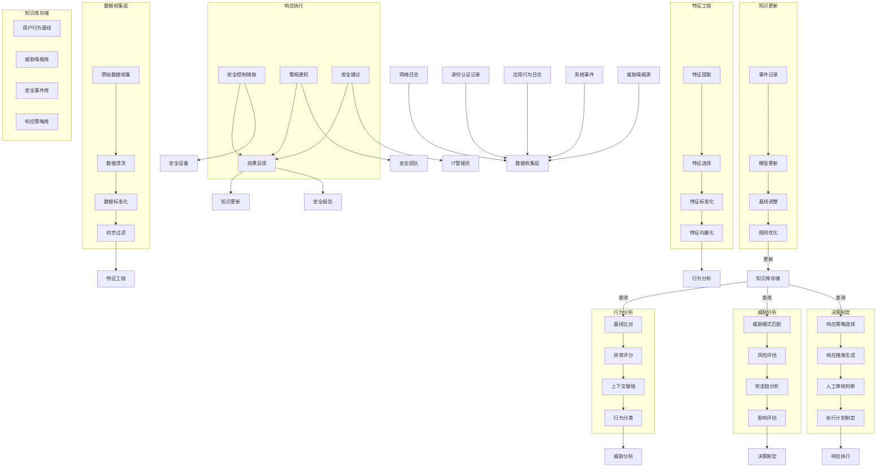

# AI-Sec-Robot 数据流图

## 数据流处理详细说明

### 1. 数据收集与预处理阶段
- **原始数据收集**：从多个数据源收集原始安全日志和用户行为数据
- **数据清洗**：去除无效、重复或错误数据
- **数据标准化**：将不同来源的数据转换为统一格式
- **初步过滤**：过滤掉明显无关的数据，减少后续处理负担

### 2. 特征工程阶段
- **特征提取**：从原始数据中提取关键行为特征
- **特征选择**：选择最具区分性的特征
- **特征标准化**：对特征进行标准化处理
- **特征向量化**：将特征转换为向量形式，便于机器学习模型处理

### 3. 行为分析阶段
- **基线比对**：将当前行为与历史基线进行比对
- **异常评分**：计算行为的异常分数
- **上下文增强**：结合上下文信息增强分析
- **行为分类**：将行为分类为正常、可疑或异常

### 4. 威胁分析阶段
- **威胁模式匹配**：将异常行为与已知威胁模式匹配
- **风险评估**：评估潜在威胁的风险级别
- **攻击链分析**：分析可能的攻击链路
- **影响评估**：评估潜在威胁的业务影响

### 5. 决策制定阶段
- **响应策略选择**：选择适当的响应策略
- **响应措施生成**：生成具体响应措施
- **人工审核判断**：对高风险决策进行人工审核
- **执行计划制定**：制定响应执行计划

### 6. 响应执行阶段
- **安全控制措施**：执行自动化安全控制措施
- **警报通知**：向安全团队发送警报
- **安全建议**：提供安全加固建议
- **结果反馈**：收集响应措施的执行结果

### 7. 知识更新阶段
- **事件记录**：记录完整事件信息
- **模型更新**：更新分析模型
- **基线调整**：调整用户行为基线
- **规则优化**：优化检测规则

### 8. 知识库存储
系统的核心知识存储：
- **用户行为基线**：存储用户正常行为模式
- **威胁情报库**：存储已知威胁情报
- **安全事件库**：存储历史安全事件
- **响应策略库**：存储有效的响应策略 