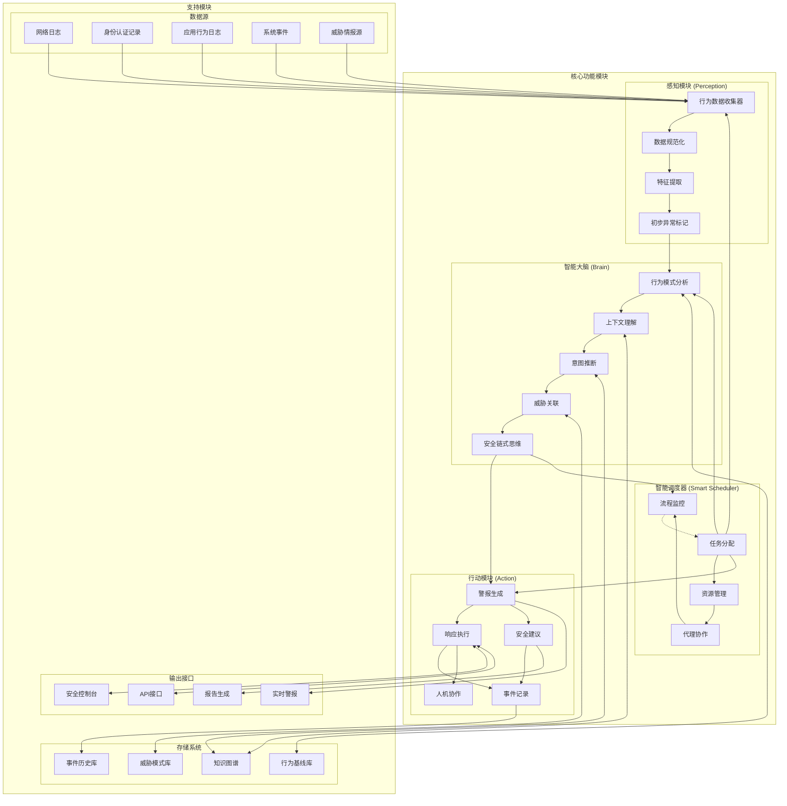

# AI-Sec-Robot 模块图

## 模块功能详细说明

### 1. 感知模块 (Perception)
作为系统的输入层，负责数据采集和初步处理：
- **行为数据收集器**：从多个来源收集用户行为数据
- **数据规范化**：将不同格式的数据统一转换为标准格式
- **特征提取**：从原始数据中提取关键行为特征
- **初步异常标记**：使用基本规则对明显异常进行初步标记

### 2. 智能大脑 (Brain)
系统的核心分析引擎，执行深度行为分析：
- **行为模式分析**：比对用户当前行为与历史行为模式
- **上下文理解**：分析行为发生的环境和上下文
- **意图推断**：推断用户行为背后的可能意图
- **威胁关联**：将行为与已知威胁模式进行关联
- **安全链式思维**：使用多步推理分析安全风险

### 3. 行动模块 (Action)
根据分析结果执行相应措施：
- **警报生成**：生成详细的安全警报信息
- **响应执行**：执行自动化安全响应措施
- **安全建议**：生成安全加固和风险缓解建议
- **事件记录**：记录事件详情用于后续分析
- **人机协作**：在需要时引入安全分析师参与决策

### 4. 智能调度器 (Smart Scheduler)
协调系统各组件的工作流程：
- **任务分配**：根据事件类型分配分析任务
- **资源管理**：优化系统资源分配
- **代理协作**：促进不同安全代理间的协作
- **流程监控**：监控整个分析流程的执行状态

### 5. 支持模块
提供核心功能所需的辅助功能：
- **数据源**：提供多种数据输入
- **存储系统**：存储行为基线、威胁情报等关键数据
- **输出接口**：提供多种形式的输出和交互界面 