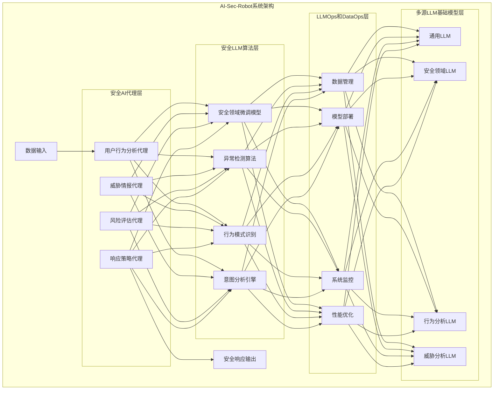

# AI-Sec-Robot 系统架构图

## 四层架构详细说明

### 1. 安全AI代理层
顶层包含专门设计的安全分析代理，各自负责特定的安全分析任务：
- **用户行为分析代理**：分析用户行为模式，识别异常活动
- **威胁情报代理**：收集和分析最新威胁情报，识别潜在威胁
- **风险评估代理**：评估检测到的异常行为的风险级别和潜在影响
- **响应策略代理**：根据分析结果制定和执行响应策略

### 2. 安全LLM算法层
提供专门为安全领域优化的算法和模型：
- **安全领域微调模型**：针对安全场景优化的语言模型
- **异常检测算法**：专门用于识别行为异常的算法
- **行为模式识别**：分析和识别用户行为模式的算法
- **意图分析引擎**：分析用户行为背后意图的引擎

### 3. LLMOps和DataOps层
负责系统的运行和维护：
- **数据管理**：处理和管理安全数据流
- **模型部署**：部署和更新AI模型
- **系统监控**：监控系统性能和健康状态
- **性能优化**：优化系统响应时间和准确率

### 4. 多源LLM基础模型层
底层提供多种大语言模型支持：
- **通用LLM**：处理一般文本理解和生成任务
- **安全领域LLM**：专注于安全领域文本的理解和分析
- **行为分析LLM**：专门分析用户行为模式的模型
- **威胁分析LLM**：专门用于威胁分析的模型 